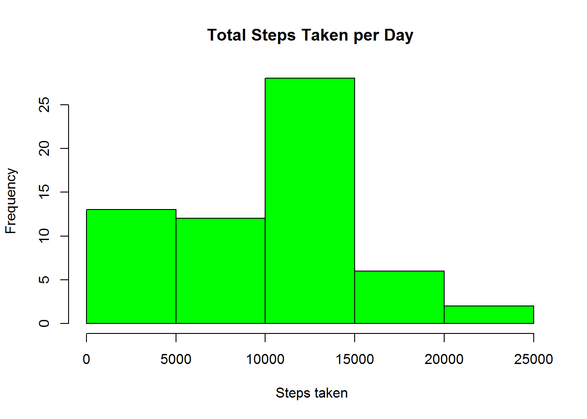

# Reproducible Research: Peer Assignment 1
Peter Chifamba  
Sunday, November 16, 2014  
## Introduction
It is now possible to collect a large amount of data about personal
movement using activity monitoring devices such as a
[Fitbit](http://www.fitbit.com), [Nike
Fuelband](http://www.nike.com/us/en_us/c/nikeplus-fuelband), or
[Jawbone Up](https://jawbone.com/up). These type of devices are part of
the "quantified self" movement -- a group of enthusiasts who take
measurements about themselves regularly to improve their health, to
find patterns in their behavior, or because they are tech geeks. But
these data remain under-utilized both because the raw data are hard to
obtain and there is a lack of statistical methods and software for
processing and interpreting the data.

This assignment makes use of data from a personal activity monitoring
device. This device collects data at 5 minute intervals through out the
day. The data consists of two months of data from an anonymous
individual collected during the months of October and November, 2012
and include the number of steps taken in 5 minute intervals each day.

##Data

The data for this assignment can be downloaded from the course web
site:

* Dataset: [Activity monitoring data](https://d396qusza40orc.cloudfront.net/repdata%2Fdata%2Factivity.zip) [52K]

The variables included in this dataset are:

* **steps**: Number of steps taking in a 5-minute interval (missing
    values are coded as `NA`)

* **date**: The date on which the measurement was taken in YYYY-MM-DD
    format

* **interval**: Identifier for the 5-minute interval in which
    measurement was taken


The dataset is stored in a comma-separated-value (CSV) file and there
are a total of 17,568 observations in this
dataset.  

### Loading and processing the data
Firts of all is to load all the required libraries for processing

```r
library(dplyr)
```

```
## 
## Attaching package: 'dplyr'
## 
## The following object is masked from 'package:stats':
## 
##     filter
## 
## The following objects are masked from 'package:base':
## 
##     intersect, setdiff, setequal, union
```

```r
library(ggplot2)
```
#### Load the Data
The data was loaded from the provided file **activity.csv** which was in the [Github fork](http://github.com/rdpeng/RepData_PeerAssessment1).

```r
Data <- read.csv("activity.csv",  na.strings ="NA", stringsAsFactor = FALSE)
```

The state of the data was checked by performing a `summary` of the data, checking the `header`, `tail` and `structure` of the data.


```r
summary(Data)
```

```
##      steps            date              interval     
##  Min.   :  0.00   Length:17568       Min.   :   0.0  
##  1st Qu.:  0.00   Class :character   1st Qu.: 588.8  
##  Median :  0.00   Mode  :character   Median :1177.5  
##  Mean   : 37.38                      Mean   :1177.5  
##  3rd Qu.: 12.00                      3rd Qu.:1766.2  
##  Max.   :806.00                      Max.   :2355.0  
##  NA's   :2304
```

```r
head(Data)
```

```
##   steps       date interval
## 1    NA 2012-10-01        0
## 2    NA 2012-10-01        5
## 3    NA 2012-10-01       10
## 4    NA 2012-10-01       15
## 5    NA 2012-10-01       20
## 6    NA 2012-10-01       25
```

```r
tail(Data)
```

```
##       steps       date interval
## 17563    NA 2012-11-30     2330
## 17564    NA 2012-11-30     2335
## 17565    NA 2012-11-30     2340
## 17566    NA 2012-11-30     2345
## 17567    NA 2012-11-30     2350
## 17568    NA 2012-11-30     2355
```

```r
str(Data)
```

```
## 'data.frame':	17568 obs. of  3 variables:
##  $ steps   : int  NA NA NA NA NA NA NA NA NA NA ...
##  $ date    : chr  "2012-10-01" "2012-10-01" "2012-10-01" "2012-10-01" ...
##  $ interval: int  0 5 10 15 20 25 30 35 40 45 ...
```
#### Process the data into a suitable format for analysis 
Change the date values to date and then the data frame to data table using dplyr for processing


```r
DT <- tbl_df(Data)
DT$date <- as.Date(DT$date)
```
  
  
#### Steps taken per Day
Group the data by date and then create a new column called sum which will be the sum of steps taken per day

```r
# group the data by date
by_date <- group_by(DT, date)
steps <- summarize(by_date, sum =(sum(steps, na.rm = TRUE)))
```
Generate histogram

```r
hist(steps$sum, breaks = 5, main ="Total Steps Taken per Day", xlab =" Steps taken", col = "green")
```

 
Calculate the mean and median

```r
meansteps <- mean(steps$sum)
mediansteps <- median(steps$sum)
```

The mean total steps taken per day is **9354.2295082** and the median is **10395**.  

### Average daily activity pattern


### Imputing missing values
### Activity patterns between weekdays and weekends
